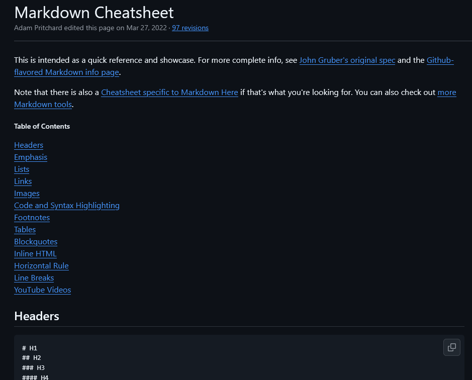

# Projeto com README
Um projeto de teste com um arquivo README 🚀

[](https://github.com/adam-p/markdown-here/wiki/Markdown-Cheatsheet?_gl=1*1aa2sh4*_ga*NzQxODI0OTc4LjE3MzE3MDY5MjE.*_ga_37GXT4VGQK*MTc0MTg4OTIxNi41OS4xLjE3NDE4OTA3NjAuMC4wLjA.)

## Tecnologias utilizadas
- HTML
- CSS
- JS

## Como utilizar
1 - Clone para o projeto
```
git clone
```
2 - Acesse a pasta do projeto
```
cd repositorio-com-readme
```